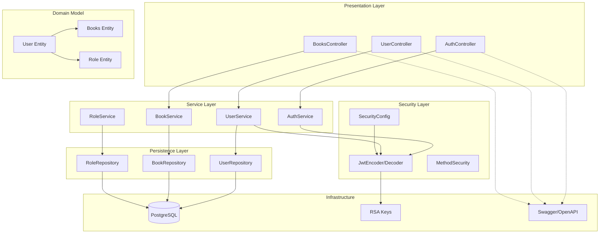
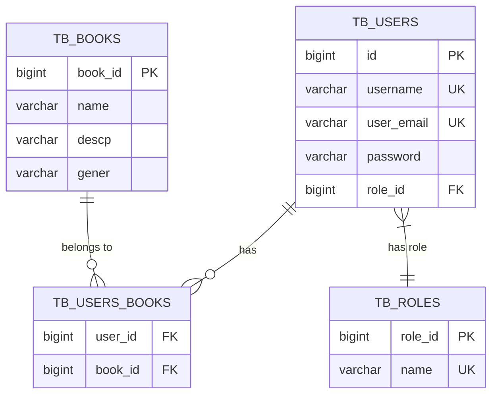
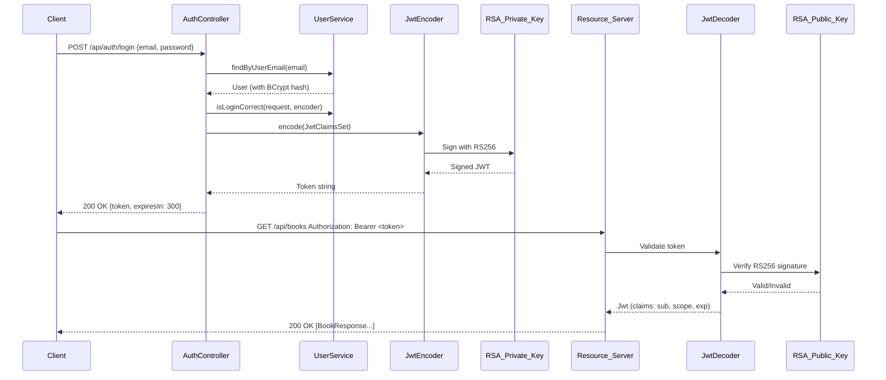
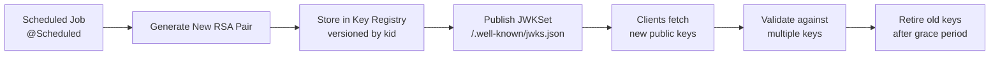
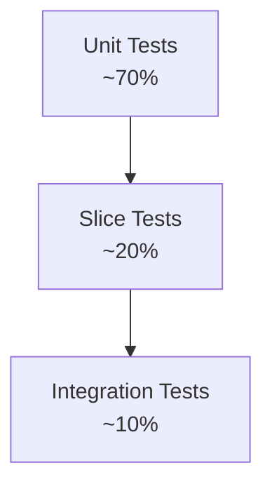

# Project Security API

[](https://openjdk.org/projects/jdk/21/)
[](https://spring.io/projects/spring-boot)
[](https://www.postgresql.org/)
[](https://jwt.io/)
[](https://maven.apache.org/)
[](LICENSE)
[]()

> **Production-ready** Spring Boot 4 REST API with **RSA-signed JWT**, **RBAC**, **OpenAPI 3**, **PostgreSQL** — built as a portfolio piece demonstrating secure backend engineering.

---

## 🎯 Project Highlights

- **🔐 RSA-signed JWT** — 2048-bit keys, stateless auth, short-lived tokens (5 min), scope-based RBAC
- **🛡️ Spring Security 6** — `SecurityFilterChain`, `MethodSecurity`, `OAuth2 Resource Server`, Nimbus JOSE JWT
- **📚 OpenAPI 3 / Swagger UI** — Fully annotated endpoints, Bearer auth integration, DTO schemas
- **🗄️ PostgreSQL + JPA** — Clean entity design, Many-to-Many join table, Flyway-ready migrations
- **🐳 Docker-first** — Multi-stage build, non-root user, healthchecks, Compose for local dev
- **🧪 Testable by design** — Slice tests, Testcontainers integration, CI-ready

---

## 🛠 Tech Stack

| Category | Technology | Version | Rationale |
|----------|------------|---------|-----------|
| **Language** | Java | 21 | LTS, virtual threads, pattern matching, records |
| **Framework** | Spring Boot | 4.1.1 | Latest, Jakarta EE 11, GraalVM native ready |
| **Security** | Spring Security | 6.4+ | OAuth2 Resource Server, JWT, Method Security |
| **Database** | PostgreSQL | 16 | ACID, JSONB, advanced indexing, production-grade |
| **ORM** | Spring Data JPA / Hibernate | 6.6+ | Repository abstraction, criteria API, projections |
| **API Docs** | SpringDoc OpenAPI | 2.6.0 | OpenAPI 3.1, Swagger UI, Kotlin/Java records support |
| **Build** | Maven Wrapper | 3.9+ | Reproducible builds, no local Maven install needed |
| **Container** | Docker | 24+ | Multi-stage, distroless-ready, healthchecks |

---

## 🏛 Architecture

### Layered Architecture



### Package Structure

```text
estudos.security.project.security
├── Application.java                 # @SpringBootApplication entry point
├── config/
│   ├── SecurityConfig.java          # SecurityFilterChain, JWT RSA beans, MethodSecurity
│   ├── SwaggerConfig.java           # OpenAPI 3, Bearer auth, API metadata
│   └── AdminConfig.java             # Bootstrap admin user on startup
├── controller/
│   ├── AuthController.java          # POST /api/auth/login → JWT
│   ├── UserController.java          # User CRUD + book cart management
│   └── BooksController.java         # Book CRUD + user-book association
├── entities/
│   ├── User.java                    # @Entity tb_users, roles, books (ManyToMany)
│   ├── Books.java                   # @Entity tb_books, users (ManyToMany)
│   ├── Role.java                    # @Entity tb_roles, enum Values {ADMIN, BASIC}
│   └── Dto/                         # Request/Response records
├── repository/                      # Spring Data JPA interfaces
├── service/                         # Business logic, validation, transactions
└── resources/
    ├── application.properties       # 12-factor config, env placeholders
    ├── data.sql                     # Seed data (roles) — to be replaced by Flyway
    ├── app.pub                      # 🔓 RSA Public Key (EXPOSED FOR DEMO)
    └── app.key                      # 🔓 RSA Private Key (EXPOSED FOR DEMO)
```

---

## 🗄 Database Schema

### Entity Relationship Diagram



### Tables (Auto-generated by Hibernate / Flyway)

| Table | Description | Key Columns |
|-------|-------------|-------------|
| `tb_users` | Users with credentials & role | `id`, `username`, `user_email`, `password`, `role_id` |
| `tb_books` | Book catalog | `book_id`, `name`, `descp`, `gener` |
| `tb_roles` | Role definitions | `role_id`, `name` (ADMIN=1, BASIC=2) |
| `tb_users_books` | Join table (Many-to-Many) | `user_id`, `book_id` |

### Flyway Migration Strategy (Planned)

```text
src/main/resources/db/migration/
├── V1__init_schema.sql          # CREATE TABLES, INDEXES, CONSTRAINTS
├── V2__seed_roles.sql           # INSERT INTO tb_roles (ADMIN, BASIC)
├── V3__add_admin_user.sql       # Bootstrap admin (configurable)
└── V4__add_book_indexes.sql     # Performance indexes on gener, name
```

> **Current**: `spring.jpa.hibernate.ddl-auto=update` + `data.sql` (dev only)  
> **Target**: `spring.jpa.hibernate.ddl-auto=validate` + Flyway (prod)

---

## 🔐 Security Deep-Dive

### JWT RSA Implementation



### Token Claims

```json
{
  "iss": "mydb",
  "sub": "1",
  "exp": 1704067200,
  "iat": 1704066900,
  "scope": "BASIC"
}
```

| Claim | Value | Purpose |
|-------|-------|---------|
| `iss` | `mydb` | Issuer identification |
| `sub` | `userId` | Subject (user identifier) |
| `exp` | `now + 300s` | Expiration (5 minutes) |
| `iat` | `now` | Issued at |
| `scope` | `ADMIN` \| `BASIC` | Role → Spring Authority `SCOPE_<ROLE>` |

### Threat Model (STRIDE)

| Threat | Vector | Mitigation | Status |
|--------|--------|------------|--------|
| **Spoofing** | Stolen/forged tokens | RSA-2048 RS256, short expiry (5min), `kid` ready | ✅ Implemented |
| **Tampering** | Token modification | JWKSet validation, signature verification | ✅ Implemented |
| **Repudiation** | Action denial | `sub`=userId, `iss`=mydb, audit log (planned) | 🟡 Partial |
| **Info Disclosure** | Key exposure | **Keys exposed intentionally for demo** — see [SECURITY.md](SECURITY.md) | ⚠️ By Design |
| **DoS** | Token flood | Stateless, no session store, rate-limiting (planned) | 📋 Planned |
| **Elevation** | Privilege escalation | `@PreAuthorize("hasAuthority('SCOPE_ADMIN')")` + MethodSecurity | ✅ Implemented |

### Key Rotation Strategy (Design)



- **JWKSet URI** endpoint for dynamic key discovery
- **`kid` (Key ID)** header in JWT for versioning
- **Grace period**: Accept last N keys during rotation
- **Flyway migration** for key registry schema

---

## 📡 API Reference

### Base URL
```
http://localhost:8089
```

### Swagger UI
```
http://localhost:8089/swagger-ui.html
```

### OpenAPI Spec
```
http://localhost:8089/v3/api-docs
```

---

### Authentication Endpoints

| Method | Endpoint | Access | Description |
|--------|----------|--------|-------------|
| `POST` | `/api/auth/login` | Public | Authenticate → returns JWT (5 min) |

**Request**
```bash
curl -X POST http://localhost:8089/api/auth/login \
  -H "Content-Type: application/json" \
  -d '{"email":"user@example.com","password":"secret123"}'
```

**Response (200)**
```json
{
  "token": "eyJhbGciOiJSUzI1NiIsInR5cCI6IkpXVCJ9...",
  "expiresIn": 300
}
```

---

### User Endpoints

| Method | Endpoint | Access | Description |
|--------|----------|--------|-------------|
| `POST` | `/api/users/register` | Public | Register new user (role BASIC) |
| `GET` | `/api/users/all` | ADMIN | List all users |
| `GET` | `/api/users/{userId}` | Authenticated | Get user by ID with books |
| `POST` | `/api/users/admin/{userId}` | ADMIN | Update user |
| `POST` | `/api/users/deleteBook/{bookId}?userId=` | Authenticated | Remove book from user's cart |

**Register Request**
```bash
curl -X POST http://localhost:8089/api/users/register \
  -H "Content-Type: application/json" \
  -d '{"username":"john","userEmail":"john@example.com","password":"secret123"}'
```

---

### Book Endpoints

| Method | Endpoint | Access | Description |
|--------|----------|--------|-------------|
| `POST` | `/api/books/create` | ADMIN | Create new book |
| `GET` | `/api/books` | Authenticated | List all (optional `?gener=`) |
| `DELETE` | `/api/books/delete/{id}` | ADMIN | Delete book |
| `GET` | `/api/books/{userId}/books` | Authenticated | User's books (paginated) |
| `POST` | `/api/books/{userId}/add` | Authenticated | Add book to user's cart |

**Create Book (ADMIN)**
```bash
curl -X POST http://localhost:8089/api/books/create \
  -H "Authorization: Bearer <ADMIN_TOKEN>" \
  -H "Content-Type: application/json" \
  -d '{"name":"Clean Code","descp":"Agile software craftsmanship","gener":"Programming"}'
```

**List Books with Filter**
```bash
curl -X GET "http://localhost:8089/api/books?gener=Programming" \
  -H "Authorization: Bearer <TOKEN>"
```

**Add Book to User**
```bash
curl -X POST http://localhost:8089/api/books/1/add \
  -H "Authorization: Bearer <TOKEN>" \
  -H "Content-Type: application/json" \
  -d '{"id": 5}'
```

---

## ⚙️ Configuration

### Application Properties

```properties
# Application
spring.application.name=project.security

# JWT RSA Keys (classpath resources)
jwt.public.key=classpath:app.pub
jwt.private.key=classpath:app.key

# Database Initialization
spring.sql.init.mode=always
spring.jpa.defer-datasource-initialization=true
spring.jpa.hibernate.ddl-auto=update

# PostgreSQL (Port 5444)
spring.datasource.url=jdbc:postgresql://${POSTGRESQL_HOST:localhost}:5444/security
spring.datasource.username=postgres
spring.datasource.password=root
spring.datasource.driver-class-name=org.postgresql.Driver

# JPA
spring.jpa.show-sql=true

# Server
server.port=8089
```

### Environment Variables

| Variable | Default | Description |
|----------|---------|-------------|
| `POSTGRESQL_HOST` | `localhost` | PostgreSQL host |
| `POSTGRESQL_PORT` | `5444` | PostgreSQL port |
| `POSTGRESQL_DB` | `security` | Database name |
| `POSTGRESQL_USER` | `postgres` | Database user |
| `POSTGRESQL_PASSWORD` | `root` | Database password |
| `JWT_PUBLIC_KEY` | `classpath:app.pub` | Public key location |
| `JWT_PRIVATE_KEY` | `classpath:app.key` | Private key location |
| `SERVER_PORT` | `8089` | HTTP port |

### Profiles

| Profile | Use Case |
|---------|----------|
| `default` | Local development (H2/PostgreSQL, ddl-auto=update) |
| `docker` | Containerized (PostgreSQL service, Flyway) |
| `prod` | Production (ddl-auto=validate, Flyway, external config) |

---

## 🐳 Docker & Deployment

### Quick Start (Docker Compose)

```bash
# Build and start all services
docker compose up --build -d

# View logs
docker compose logs -f app

# Stop
docker compose down -v
```

### Docker Compose Services

```yaml
# docker-compose.yml
services:
  postgres:
    image: postgres:16-alpine
    container_name: project-security-db
    environment:
      POSTGRES_DB: security
      POSTGRES_USER: postgres
      POSTGRES_PASSWORD: root
    ports:
      - "5444:5432"
    volumes:
      - postgres_data:/var/lib/postgresql/data
    healthcheck:
      test: ["CMD-SHELL", "pg_isready -U postgres -d security"]
      interval: 5s
      timeout: 3s
      retries: 10
    networks:
      - app-network

  app:
    build:
      context: .
      dockerfile: Dockerfile
    container_name: project-security-api
    environment:
      POSTGRESQL_HOST: postgres
      POSTGRESQL_PORT: 5432
      SPRING_PROFILES_ACTIVE: docker
    ports:
      - "8089:8089"
    depends_on:
      postgres:
        condition: service_healthy
    healthcheck:
      test: ["CMD", "wget", "-q", "--spider", "http://localhost:8089/actuator/health"]
      interval: 10s
      timeout: 3s
      retries: 5
    networks:
      - app-network

volumes:
  postgres_data:

networks:
  app-network:
    driver: bridge
```

### Multi-Stage Dockerfile

```dockerfile
# Dockerfile
# ---- Build Stage ----
FROM maven:3.9-eclipse-temurin-21 AS build
WORKDIR /app
COPY pom.xml .
COPY src ./src
RUN mvn -B -DskipTests package

# ---- Runtime Stage ----
FROM eclipse-temurin:21-jre-alpine
WORKDIR /app

# Non-root user
RUN addgroup -g 1001 -S appgroup && \
    adduser -u 1001 -S appuser -G appgroup

# Copy built artifact
COPY --from=build /app/target/*.jar app.jar

# Healthcheck
HEALTHCHECK --interval=30s --timeout=3s --start-period=10s --retries=3 \
  CMD wget -q --spider http://localhost:8089/actuator/health || exit 1

USER appuser
EXPOSE 8089
ENTRYPOINT ["java", "-XX:+UseContainerSupport", "-XX:MaxRAMPercentage=75", "-jar", "app.jar"]
```

### Health Endpoints (Spring Boot Actuator)

Add to `pom.xml`:
```xml
<dependency>
    <groupId>org.springframework.boot</groupId>
    <artifactId>spring-boot-starter-actuator</artifactId>
</dependency>
```

```properties
management.endpoints.web.exposure.include=health,info
management.endpoint.health.show-details=always
```

---

## 🧪 Testing Strategy

### Test Pyramid



| Layer | Tools | Coverage Target | Example |
|-------|-------|-----------------|---------|
| **Unit** | JUnit 5, Mockito, AssertJ | 80%+ | `UserServiceTest`, `BookServiceTest` |
| **Slice** | `@WebMvcTest`, `@DataJpaTest` | Controllers, Repositories | `AuthControllerTest`, `UserRepositoryTest` |
| **Integration** | `@SpringBootTest`, Testcontainers | Critical flows | `AuthIntegrationTest`, `BookUserFlowTest` |

### Testcontainers Integration (Planned)

```java
@Testcontainers
@SpringBootTest
class AuthIntegrationTest {

    @Container
    static PostgreSQLContainer<?> postgres = new PostgreSQLContainer<>("postgres:16")
            .withDatabaseName("security")
            .withUsername("postgres")
            .withPassword("root");

    @DynamicPropertySource
    static void configure(DynamicPropertyRegistry registry) {
        registry.add("spring.datasource.url", postgres::getJdbcUrl);
        registry.add("spring.datasource.username", postgres::getUsername);
        registry.add("spring.datasource.password", postgres::getPassword);
    }

    @Autowired MockMvc mvc;
    @Autowired JwtEncoder encoder;

    @Test
    void login_returnsValidJwt() throws Exception {
        // given: user exists
        // when: POST /api/auth/login
        // then: 200 + valid JWT with scope claim
    }
}
```

### Running Tests

```bash
# Unit + Slice tests
./mvnw test

# Integration tests (requires PostgreSQL)
./mvnw verify -Pintegration-test
```

---

## 🚀 Roadmap

<details>
<summary><strong>Click to expand roadmap</strong></summary>

| Priority | Feature | Status | Technical Design |
|----------|---------|--------|------------------|
| **P0** | **Flyway Migrations** | 📋 Planned | `V1__init.sql` → `V2__seed.sql` → `V3__indexes.sql`; `baselineOnMigrate=true` |
| **P0** | **Auto RSA Key Generation** | 📋 Planned | `CommandLineRunner` generates keys on first run, writes to `src/main/resources/`, logs warning |
| **P0** | **Docker Compose + Dockerfile** | 📋 Planned | Multi-stage, non-root, healthchecks, Compose with `service_healthy` |
| **P1** | **Refresh Token** | 💡 Design | Rotating refresh tokens, Redis store, revocation endpoint |
| **P1** | **Rate Limiting** | 💡 Design | `Bucket4j` or `Resilience4j`, per-IP + per-user, configurable policies |
| **P1** | **Audit Logging** | 💡 Design | `@EntityListeners(AuditingEntityListener)`, `CreatedBy`, `LastModifiedBy` |
| **P2** | **API Versioning** | 💡 Design | URL versioning `/api/v1/`, `Accept` header, OpenAPI versioning |
| **P2** | **Caching** | 💡 Design | `Caffeine` L2 cache for books, `@Cacheable`, cache invalidation on write |
| **P2** | **Observability** | 💡 Design | Micrometer + Prometheus + Grafana, distributed tracing (Micrometer Tracing) |
| **P3** | **GraalVM Native** | 💡 Design | `spring-aot`, reachability metadata, native test container |

### Detailed Design Notes

#### Flyway Migrations
```xml
<!-- pom.xml -->
<dependency>
    <groupId>org.flywaydb</groupId>
    <artifactId>flyway-core</artifactId>
</dependency>
<dependency>
    <groupId>org.flywaydb</groupId>
    <artifactId>flyway-database-postgresql</artifactId>
</dependency>
```

```properties
# application-prod.properties
spring.flyway.enabled=true
spring.flyway.baseline-on-migrate=true
spring.flyway.validate-on-migrate=true
spring.jpa.hibernate.ddl-auto=validate
```

#### Auto RSA Key Generation
```java
@Component
@Profile("!prod") // Only dev/docker
public class RsaKeyGenerator implements CommandLineRunner {

    private static final Logger log = LoggerFactory.getLogger(RsaKeyGenerator.class);

    @Override
    public void run(String... args) throws Exception {
        Path keyDir = Paths.get("src/main/resources");
        Path privateKey = keyDir.resolve("app.key");
        Path publicKey = keyDir.resolve("app.pub");

        if (Files.exists(privateKey) && Files.exists(publicKey)) {
            log.info("RSA keys already exist, skipping generation");
            return;
        }

        KeyPairGenerator kpg = KeyPairGenerator.getInstance("RSA");
        kpg.initialize(2048);
        KeyPair pair = kpg.generateKeyPair();

        // Write PKCS#8 private key
        try (var writer = new PemWriter(new FileWriter(privateKey.toFile()))) {
            writer.writeObject(new PemObject("PRIVATE KEY", pair.getPrivate().getEncoded()));
        }

        // Write X.509 public key
        try (var writer = new PemWriter(new FileWriter(publicKey.toFile()))) {
            writer.writeObject(new PemObject("PUBLIC KEY", pair.getPublic().getEncoded()));
        }

        log.warn("""
            ╔══════════════════════════════════════════════════════════════╗
            ║  🔓 RSA KEYS GENERATED AUTOMATICALLY — EXPOSED IN REPO      ║
            ║  ⚠️  FOR DEVELOPMENT/DEMO ONLY — NEVER USE IN PRODUCTION   ║
            ╚══════════════════════════════════════════════════════════════╝
            """);
    }
}
```

</details>

---

## 📁 Project Structure (Detailed)

```text
project.security/
├── .github/workflows/
│   └── ci.yml                     # CI: test, build, docker publish
├── src/
│   ├── main/
│   │   ├── java/estudos/security/project/security/
│   │   │   ├── Application.java
│   │   │   ├── config/
│   │   │   │   ├── SecurityConfig.java
│   │   │   │   ├── SwaggerConfig.java
│   │   │   │   └── AdminConfig.java
│   │   │   ├── controller/
│   │   │   │   ├── AuthController.java
│   │   │   │   ├── UserController.java
│   │   │   │   └── BooksController.java
│   │   │   ├── entities/
│   │   │   │   ├── User.java
│   │   │   │   ├── Books.java
│   │   │   │   ├── Role.java
│   │   │   │   └── Dto/
│   │   │   │       ├── LoginRequest.java
│   │   │   │       ├── LoginResponse.java
│   │   │   │       ├── CreateUserDto.java
│   │   │   │       ├── UserResponse.java
│   │   │   │       ├── CreateBookRequest.java
│   │   │   │       ├── BookResponse.java
│   │   │   │       └── AssociateBookRequestDTO.java
│   │   │   ├── repository/
│   │   │   │   ├── UserRepository.java
│   │   │   │   ├── BookRepository.java
│   │   │   │   └── RoleRepository.java
│   │   │   └── service/
│   │   │       ├── UserService.java
│   │   │       ├── BookService.java
│   │   │       └── RoleService.java
│   │   └── resources/
│   │       ├── application.properties
│   │       ├── application-docker.properties
│   │       ├── application-prod.properties
│   │       ├── data.sql
│   │       ├── app.pub              # 🔓 RSA Public (EXPOSED)
│   │       └── app.key              # 🔓 RSA Private (EXPOSED)
│   └── test/
│       └── java/.../ApplicationTests.java
├── docker-compose.yml               # Local dev stack
├── Dockerfile                       # Multi-stage production image
├── pom.xml                          # Maven build
├── mvnw / mvnw.cmd                  # Maven Wrapper
├── README.md                        # This file
├── SECURITY.md                      # Security policy & threat model
└── LICENSE                          # MIT License
```

---

## ⚠️ Important Notes

| Topic | Detail |
|-------|--------|
| **RSA Keys Exposed** | `app.key` / `app.pub` committed **intentionally** for zero-config demo. **Never do this in production.** See [SECURITY.md](SECURITY.md). |
| **Database Password** | Hardcoded `root` in `application.properties`. Use env vars / secrets manager in prod. |
| **Port 5444** | PostgreSQL runs on non-standard port 5444 (avoids conflict with local 5432). |
| **DDL Auto Update** | `spring.jpa.hibernate.ddl-auto=update` for dev only. Prod uses Flyway + `validate`. |
| **Token Expiry** | 5 minutes (300s) — short for demo. Production: 15-30min + refresh tokens. |

---

## 📝 License

MIT License — Free for learning, portfolio, and commercial use.

---

## 👤 Author

Developed as a **portfolio project** demonstrating:

- Secure REST API design with Spring Boot 4
- RSA-signed JWT authentication & authorization
- Clean architecture, DDD-lite domain modeling
- Production-ready concerns: Docker, CI, observability, security

[](https://github.com/seu-usuario)
[](https://linkedin.com/in/seu-perfil)

---

> **Star ⭐ this repo if you found it useful!**  
> Questions? Open an [issue](../../issues) or connect on LinkedIn.