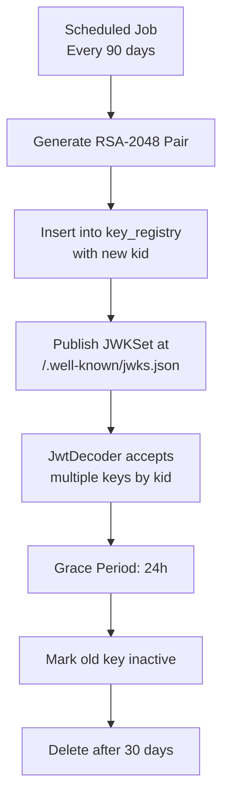

# Security Policy

## 🔒 Supported Versions

| Version | Supported | Status |
|---------|-----------|--------|
| 4.1.x   | ✅ Yes    | Active development |
| < 4.0   | ❌ No     | End of life |

---

## 🚨 Reporting a Vulnerability

**Do not open public issues for security vulnerabilities.**

Instead, please report via:
- **Email**: security@yourdomain.com (replace with your contact)
- **GitHub Security Advisory**: [Private vulnerability report](../../security/advisories/new)

**Response SLA**:
- Acknowledgment: **48 hours**
- Initial assessment: **5 business days**
- Fix timeline: **30 days** (critical), **90 days** (high/medium)

---

## ⚠️ Known Security Considerations

### 1. RSA Keys Committed to Repository (Intentional)

> **This is a deliberate design decision for portfolio/demo purposes.**

| File | Purpose | Risk |
|------|---------|------|
| `src/main/resources/app.key` | RSA Private Key (PKCS#8) | **HIGH** - Can sign arbitrary JWTs |
| `src/main/resources/app.pub` | RSA Public Key (X.509) | LOW - Public by design |

**Why?**
- Zero-config clone & run for recruiters/reviewers
- Demonstrates JWT RSA flow without key generation setup
- Clear documentation of the tradeoff

**Production Mitigation:**
- **Never commit keys** — use secret managers (Vault, AWS Secrets Manager, Kubernetes Secrets)
- Generate unique keys per environment at deploy time
- Rotate keys regularly (see [Key Rotation Strategy](#key-rotation-strategy))

---

### 2. Database Credentials in Config

```properties
spring.datasource.password=root  # Hardcoded for dev
```

**Production**: Use environment variables + secret injection:
```properties
spring.datasource.password=${DB_PASSWORD:}  # Required at runtime
```

---

### 3. Short Token Expiry (5 minutes)

```java
var expiresIn = 300L; // 5 minutes
```

**Rationale**: Demo-friendly, limits blast radius of token theft.
**Production**: 15-30 min access tokens + rotating refresh tokens.

---

### 4. No Rate Limiting (Current)

**Planned**: Bucket4j / Resilience4j integration
```xml
<dependency>
    <groupId>com.github.bucket4j</groupId>
    <artifactId>bucket4j-spring-boot3-starter</artifactId>
</dependency>
```

---

## 🛡️ Threat Model (STRIDE)

| Threat | Description | Likelihood | Impact | Mitigation | Status |
|--------|-------------|------------|--------|------------|--------|
| **Spoofing** | Attacker impersonates valid user | Medium | High | RSA-2048 RS256, 5-min expiry, `kid` header support | ✅ Implemented |
| **Tampering** | Modify token claims | Low | High | JWKSet validation, signature verification | ✅ Implemented |
| **Repudiation** | User denies actions | Medium | Medium | `sub`=userId, `iss`=mydb, audit log (planned) | 🟡 Partial |
| **Info Disclosure** | Key/token leakage | High* | High | Keys exposed **intentionally for demo** | ⚠️ By Design |
| **DoS** | Token flood, auth bypass | Low | Medium | Stateless, no session store, rate limiting (planned) | 📋 Planned |
| **Elevation** | Privilege escalation | Low | Critical | `@PreAuthorize("hasAuthority('SCOPE_ADMIN')")`, MethodSecurity | ✅ Implemented |

> *High likelihood only because keys are in repo for demo. In production: Low.

---

## 🔐 Security Architecture

### Authentication Flow

```
1. Client → POST /api/auth/login (email, password)
2. Server → Validate credentials (BCrypt)
3. Server → Build JwtClaimsSet (iss, sub, exp, iat, scope)
4. Server → Sign with RSA Private Key (RS256) via NimbusJwtEncoder
5. Server → Return JWT + expiresIn
6. Client → Authorization: Bearer <jwt>
7. Server → JwtDecoder validates with RSA Public Key
8. Server → Extract authorities from "scope" claim → SCOPE_<ROLE>
9. Server → @PreAuthorize checks authorities
```

### Key Components

| Component | Class | Responsibility |
|-----------|-------|----------------|
| `SecurityFilterChain` | `SecurityConfig` | Stateless, CSRF off, OAuth2 Resource Server |
| `JwtEncoder` | `SecurityConfig.jwtEncoder()` | Sign tokens with private key |
| `JwtDecoder` | `SecurityConfig.jwtDecoder()` | Validate tokens with public key |
| `MethodSecurity` | `@EnableMethodSecurity` | `@PreAuthorize` on controllers |
| `PasswordEncoder` | `BCryptPasswordEncoder` | Hash passwords (strength 10) |

### Authority Mapping

```java
// AuthController.java
var scope = Optional.ofNullable(user.getRoleUser())
        .map(role -> role.getName().toUpperCase())  // "ADMIN" or "BASIC"
        .orElse("");

// Spring Security expects: SCOPE_<value>
.claim("scope", scope)  // → "SCOPE_ADMIN" or "SCOPE_BASIC"
```

---

## 🔄 Key Rotation Strategy (Design)

### Current State
- Static keys in `src/main/resources/`
- No rotation mechanism
- Single key pair for all environments

### Target Architecture

```
┌─────────────────────────────────────────────────────────────┐
│                    KEY REGISTRY (Flyway)                    │
├─────────────┬──────────────┬────────────┬──────────────────┤
│ kid (PK)    │ public_key   │ private_key │ created_at      │
│ "v1"        │ ──────────   │ ──────────  │ 2024-01-15      │
│ "v2"        │ ──────────   │ ──────────  │ 2024-07-20      │
└─────────────┴──────────────┴────────────┴──────────────────┘
```

### Rotation Flow



### Implementation Plan

1. **Flyway Migration** `V5__create_key_registry.sql`
2. **KeyRegistry Entity + Repository**
3. **JwkSetEndpoint** `GET /.well-known/jwks.json`
4. **MultiKeyJwtDecoder** - resolves `kid` → public key
5. **ScheduledKeyRotationService** - `@Scheduled(cron = "0 0 3 * * SUN")`
6. **Config** - `security.jwt.rotation.enabled=true`

---

## 📋 Security Checklist for Production

### Pre-Deploy

- [ ] Generate unique RSA keys per environment (CI/CD secret injection)
- [ ] Remove `app.key` / `app.pub` from repo history (`git filter-repo` or BFG)
- [ ] Set `spring.jpa.hibernate.ddl-auto=validate`
- [ ] Enable Flyway with baseline
- [ ] Configure external secret management
- [ ] Enable HTTPS (TLS 1.3) + HSTS
- [ ] Set secure cookies (`Secure`, `HttpOnly`, `SameSite=Strict`)
- [ ] Configure CORS allowlist (no `*`)
- [ ] Enable rate limiting (Bucket4j)
- [ ] Add audit logging for auth events
- [ ] Configure actuator security (`management.endpoints.web.exposure.include=health,info` only)
- [ ] Run OWASP Dependency Check (`mvn org.owasp:dependency-check-maven:check`)
- [ ] Run SAST (SonarQube, CodeQL)

### Runtime

- [ ] Monitor failed auth attempts (alerting)
- [ ] Log token validation failures (no PII)
- [ ] Key rotation job verified
- [ ] Certificate expiry monitoring
- [ ] Dependency update schedule (Renovate/Dependabot)

---

## 📚 Secure Coding Practices Used

| Practice | Implementation |
|----------|----------------|
| **Parameterized Queries** | Spring Data JPA (no raw SQL) |
| **Input Validation** | Bean Validation (`@Valid`, `@NotNull`, `@Email`, `@Size`) |
| **Output Encoding** | Spring MVC + Jackson (JSON), no XSS in REST API |
| **Authentication** | JWT RS256, stateless, short expiry |
| **Authorization** | RBAC + Method Security (`@PreAuthorize`) |
| **Password Storage** | BCrypt (cost 10), never logged |
| **Error Handling** | Generic error responses, no stack traces in prod |
| **Logging** | Structured (JSON), no secrets, correlation IDs |
| **Dependencies** | `mvn dependency-check`, `versions:display-plugin-updates` |

---

## 🔗 References

- [OWASP Authentication Cheatsheet](https://cheatsheetseries.owasp.org/cheatsheets/Authentication_Cheat_Sheet.html)
- [OWASP JWT Cheatsheet](https://cheatsheetseries.owasp.org/cheatsheets/JSON_Web_Token_Cheat_Sheet.html)
- [Spring Security Reference](https://docs.spring.io/spring-security/reference/)
- [Nimbus JOSE JWT](https://connect2id.com/products/nimbus-jose-jwt)
- [RFC 7519 (JWT)](https://datatracker.ietf.org/doc/html/rfc7519)
- [RFC 7517 (JWK)](https://datatracker.ietf.org/doc/html/rfc7517)

---

## 📞 Contact

Security questions or responsible disclosure:
- **Email**: security@yourdomain.com
- **GitHub Security**: [Advisories](../../security/advisories)

---

> **Last Updated**: 2024  
> **Policy Version**: 1.0  
> **Next Review**: 2025-01-01